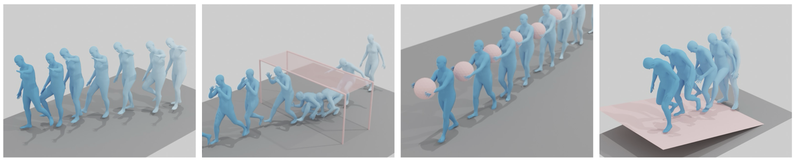

# Programmable Motion Generation for Open-Set Motion Control Tasks - Jittor (CVPR24)


This repository contains [Jittor](http://cg.cs.tsinghua.edu.cn/jittor/) implementation for the paper [**"Programmable Motion Generation for Open-Set Motion Control Tasks"**]() (CVPR24). 

[**arXiv version**](https://arxiv.org/pdf/2405.19283), 
[**project page**](https://hanchaoliu.github.io/Prog-MoGen/)

[**pytorch repo**](https://github.com/HanchaoLiu/ProgMoGen)


## Getting started

#### 1. Setup environment
This project mainly depends on [Jittor](http://cg.cs.tsinghua.edu.cn/jittor/), [JCLIP](https://github.com/uyzhang/JCLIP) and [PriorMDM](https://github.com/priorMDM/priorMDM)/[MDM](https://github.com/GuyTevet/motion-diffusion-model).

```
pip install jittor
pip install ftfy regex tqdm
git clone https://github.com/uyzhang/JCLIP.git
cd JCLIP
python setup.py develop
```


#### 2. Download necessary data files

The data files required for running experiments are the same as [MDM](https://github.com/GuyTevet/motion-diffusion-model). The required files include:

- pretrained MDM model: `model000475000.pt` and `args.json`. Available at [HumanML3D humanml-encoder-512 (best model)](https://drive.google.com/file/d/1PE0PK8e5a5j-7-Xhs5YET5U5pGh0c821/view?usp=sharing) provided by [MDM](https://github.com/GuyTevet/motion-diffusion-model). Place the folder as `progmogen/save/humanml_trans_enc_512`.


<!-- get directory `motion-diffusion-model/dataset` from [MDM](https://github.com/GuyTevet/motion-diffusion-model) and place it as `progmogen/dataset`. -->

- body_models: Download files from `progmogen/prepare/download_smpl_files.sh` (a folder named `smpl`) and place it under `progmogen/body_models`. 

```
bash prepare/download_smpl_files.sh
```

Convert pre-trained MDM and CLIP weights into Jittor format. Jittor weight files will be saved under `progmogen/save_jittor`.
```
python model/convert_weight_jittor.py
cp save/humanml_trans_enc_512/args.json save_jittor/
```
Please refer to `config_data.py` for the paths to MDM and CLIP weights.

#### 3. Get HumanML3D data

Place HumanML3D folder under `progmogen/dataset` as `progmogen/dataset/HumanML3D`.

a. The easy way (for demo only)

[HumanML3D](https://github.com/EricGuo5513/HumanML3D.git)  - If you wish to run the demo only, motion data is not needed and just prepare `Mean.npy` and `Std.npy`.
```
cp -r my_data/HumanML3D dataset/HumanML3D
```


After these steps, the data will be organized as following
```
progmogen
|-- save_jittor
     |--args.json
     |--model000475000.pkl
     |--ViT-B-32.pkl
|-- body_models
     |-- smpl
|-- dataset
     |-- humanml_opt.txt
     |-- t2m_mean.npy
     |-- t2m_std.npy
     |-- HumanML3D
          |-- Mean.npy
          |-- Std.npy

TEMOS-master
```


#### 5. Install blender for visualization (optional)

We use blender code from project [TEMOS](https://github.com/Mathux/TEMOS) for visualization. Follow the [instruction](https://github.com/Mathux/TEMOS) to install blender and bpy dependencies.
In `progmogen/script_demo/*.sh` scripts, replace `blender_app` path with your own path to blender application, and replace `project_dir` with your own absolute path to this github project. 

In order to estimate SMPL mesh from joints, please follow [PriorMDM](https://github.com/priorMDM/priorMDM)/[MDM](https://github.com/GuyTevet/motion-diffusion-model) to build an enviroment and install necessary dependencies. 


## Project structure
```
progmogen
  |--diffusion          # ddim
  |--atomic_lib         # atomic constraint library
  |--tasks              # main program
  |--script_demo        # run demo
  |--task_configs       # define error function and optimization parameters for demo.
  |--config_data.py
  ...
TEMOS-master
  |--render_demo_*.py   # main rendering program for each task
  |--temos
       |--render
            |--blender
                 |--render_*.py  # draw scenes
```

## Demo
We provide scripts in `progmogen/script_demo` for runnning examples presented in the paper. The script will generate motion `gen.npy` and fit smpl body sequences `gen_smpl/gen*_smpl_params.npy`. 
 
For visualization, we provide (1) stick figure animation `gen*_video.gif` using matplotlib, and (2) image and video rendering `gen_smpl/gen*_smpl_params.png/mp4` using blender (scenes and objects are drawn using blender only).

Results will be saved to `save_fig_dir` (under `progmogen/results/demo_jt`) and you can change in the script on your own. 

**Note that** here we use DDIM model with 50 steps for Jittor implementation (instead of 100 steps in pytorch as represented in paper). So expect difference between the generated motions and those in the pytorch repository.


```
cd progmogen
```

Motion Control with High-order Dynamics
```bash
sh script_demo/run_demo_hod1_jt.sh
```


Human-Scene Interaction
```bash
sh script_demo/run_demo_hsi3_jt.sh
sh script_demo/run_demo_hsi4_jt.sh
```

Human-Object Interaction
```bash
sh script_demo/run_demo_hoi2_jt.sh
```

Human Self-Contact
```bash
sh script_demo/run_demo_hsc1_jt.sh
```

Physics-based Generation
```bash
sh script_demo/run_demo_pbg2_jt.sh
```


Other examples
```bash
sh script_demo/run_demo_dir_jt.sh
sh script_demo/run_demo_or_jt.sh
```


For any other customized tasks, just write a `task_config.py` with customized `f_loss` and `f_eval`, assign appropriate optimization parameters and feed to `--task_config ${task_config}`.

Please refer to [our pytorch repository](https://github.com/HanchaoLiu/ProgMoGen) for more examples and features such as support for constraint relaxation and defining target positions. 


<!--  -->

## Evaluation
Please refer to [our pytorch repository](https://github.com/HanchaoLiu/ProgMoGen) for more evaluation.


## Acknowledgements

Our code is heavily built on:
[PriorMDM](https://github.com/priorMDM/priorMDM),
[MDM](https://github.com/GuyTevet/motion-diffusion-model),
[TEMOS](https://github.com/Mathux/TEMOS), 
[GMD](https://github.com/korrawe/guided-motion-diffusion/),
[HumanML3D](https://github.com/EricGuo5513/HumanML3D) and 
[JCLIP](https://github.com/uyzhang/JCLIP). 
We thank them for kindly releasing their code.

#### Bibtex
If you find this code useful in your research, please consider citing:

```
@inproceedings{liu2024programmable,
title={Programmable Motion Generation for Open-Set Motion Control Tasks},
author={Liu, Hanchao and Zhan, Xiaohang and Huang, Shaoli and Mu, Tai-Jiang and Shan, Ying},
booktitle={CVPR},
year={2024}
}
```


## License
This code is distributed under an [MIT LICENSE](LICENSE).

Note that our code depends on other libraries, including Jittor, CLIP, SMPL, SMPL-X, PyTorch3D, and uses datasets that each have their own respective licenses that must also be followed.